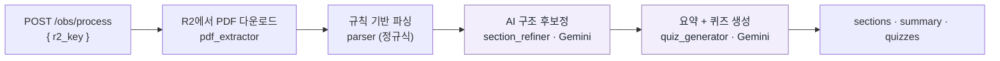
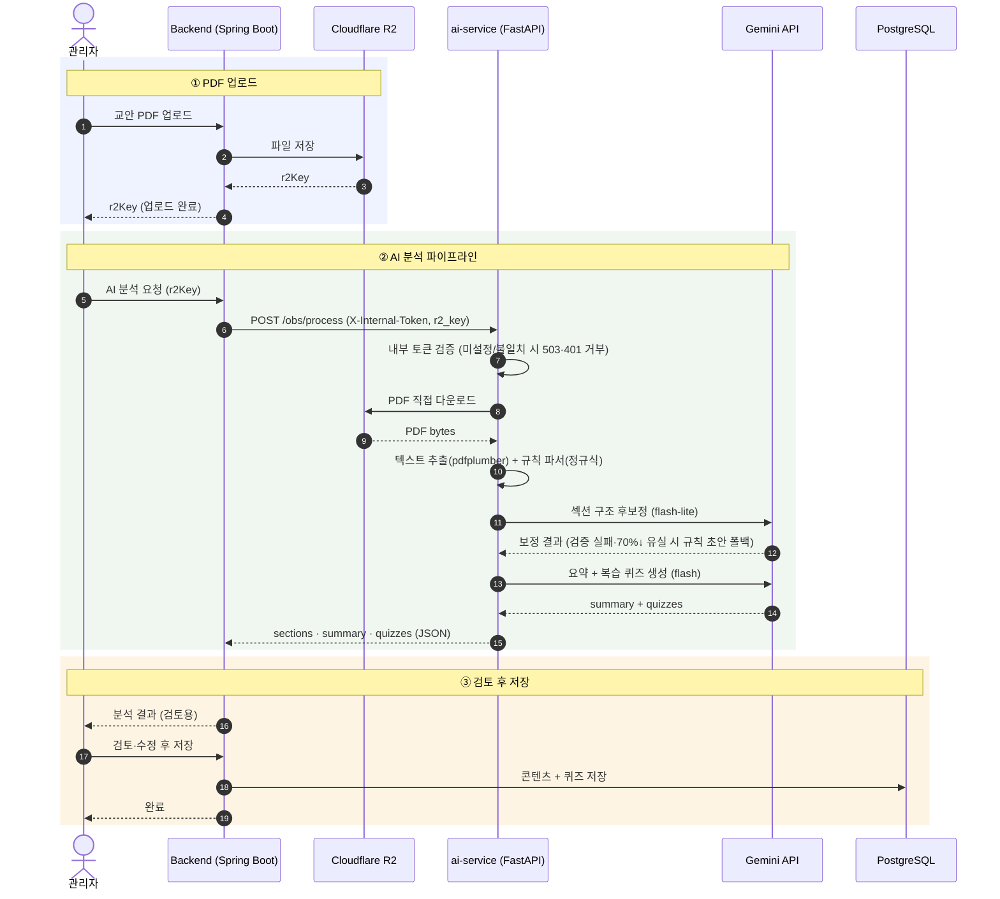

<div align="center">

# Loen — AI Service

**주일 말씀(OBS) PDF를 분석해 요약·복습 퀴즈를 자동 생성하는 서비스**


</div>

---

## 개요

Loen AI Service는 교회 주일 말씀 교안(PDF)을 입력받아 **① 구조화된 섹션 트리 ②
핵심 요약 ③ 복습 퀴즈(OX·단답·서술)** 를 생성하는 내부 전용 FastAPI 서비스입니다.

[Loen 백엔드](https://github.com/Logos-engineers/loen-backend)가 PDF를 Cloudflare R2에
업로드한 뒤 이 서비스를 **중계 호출**하고, 서비스는 R2에서 직접 파일을 내려받아 처리합니다.
프론트엔드에 직접 노출되지 않습니다.

> 전체 시스템 구조는 조직 프로필 → **[Logos Engineers](https://github.com/Logos-engineers)** 참고

## 처리 파이프라인



### 전체 시퀀스 (백엔드 중계 포함)

위 파이프라인이 백엔드·R2·Gemini와 어떻게 주고받는지를 시간 순서로 본 흐름입니다.



## 핵심 설계

- **🧩 규칙 + AI 하이브리드 파싱** — 섹션 구조는 먼저 **정규식 규칙 파서**로 초안을 만들고
  (`1.` `(1)` `①` `a.` 등 계층 패턴), 그 뒤 Gemini로 **구조만 후보정**(`section_refiner`).
  처음부터 LLM에 맡기지 않아 **번호·계층은 코드가 재계산**하고, 후보정 실패 시 규칙 초안으로 **폴백**
- **⚡ 경량 모델 선택** — 후보정은 기계적 재구조화라 `gemini-2.5-flash-lite` 사용.
  `flash`(thinking)는 이 작업에 60~100s가 걸려 전체를 타임아웃시킨 QA 결과를 반영한 결정.
  `ENABLE_SECTION_REFINE=false` 킬 스위치로 후보정 단계만 끌 수 있음
- **🔒 내부 전용 · fail-closed** — `INTERNAL_API_TOKEN` 공유 시크릿으로 백엔드 중계만 허용.
  **토큰 미설정 시 503으로 거부**(열려버리지 않게). `r2_key`는 화이트리스트 패턴으로 검증해
  경로 탈출·임의 객체 접근 차단
- **🛡️ 신뢰 경계 분리** — 내부 오류 원문은 서버 로그에만 남기고 응답에는 일반 메시지만 반환

## API

| 메서드 | 경로 | 설명 |
|--------|------|------|
| `GET` | `/health` | 헬스 체크 |
| `POST` | `/obs/process` | OBS PDF 분석 → 섹션·요약·퀴즈 생성 (`X-Internal-Token` 필요) |

**요청** `POST /obs/process`
```json
{ "r2_key": "dev/obs/<uuid>.pdf" }
```
**응답**
```json
{ "sections": [...], "summary": ["...", "...", "..."], "quizzes": [...] }
```

## 프로젝트 구조

```
main.py                     # FastAPI 앱 · 라우터 등록 · /health
routers/
  obs.py                    # POST /obs/process — 파이프라인 오케스트레이션 + 인증/검증
services/
  pdf_extractor.py          # R2 다운로드 + pdfplumber 텍스트 추출
  parser.py                 # 정규식 규칙 기반 섹션 파싱
  section_refiner.py        # Gemini 구조 후보정 (토글 가능, 실패 시 폴백)
  quiz_generator.py         # Gemini 요약 + 퀴즈 생성
  r2_client.py              # Cloudflare R2 (S3 호환) 클라이언트
```

## 로컬 실행

```bash
pip install -r requirements.txt
uvicorn main:app --reload --port 8000

# 또는 Docker
docker build -t loen-ai .
docker run -p 8000:8000 --env-file .env loen-ai
```

**환경 변수** (`.env`)
```
GEMINI_API_KEY
CLOUDFLARE_ACCOUNT_ID, R2_ACCESS_KEY_ID, R2_SECRET_ACCESS_KEY, R2_BUCKET_NAME
INTERNAL_API_TOKEN          # 백엔드의 AI_INTERNAL_TOKEN 과 동일해야 함
ENABLE_SECTION_REFINE=true  # (선택) AI 후보정 단계 킬 스위치
```

## 배포

- **dev** — Raspberry Pi self-hosted 러너에서 Docker로 자동 배포 (컨테이너 `loen-ai:8000`)
- 백엔드(`prod`는 Railway)와 분리 운영

## 관련 저장소

- [loen-backend](https://github.com/Logos-engineers/loen-backend) — 메인 API 서버 (이 서비스를 중계 호출)
- [loen-frontend](https://github.com/Logos-engineers/loen-frontend) — 모바일 앱
- [loen-qa-bot](https://github.com/Logos-engineers/loen-qa-bot) — QA 제보 자동 분류 봇

---

<div align="center">
<sub>← 전체 구조: <a href="https://github.com/Logos-engineers">Logos Engineers</a></sub>
</div>
